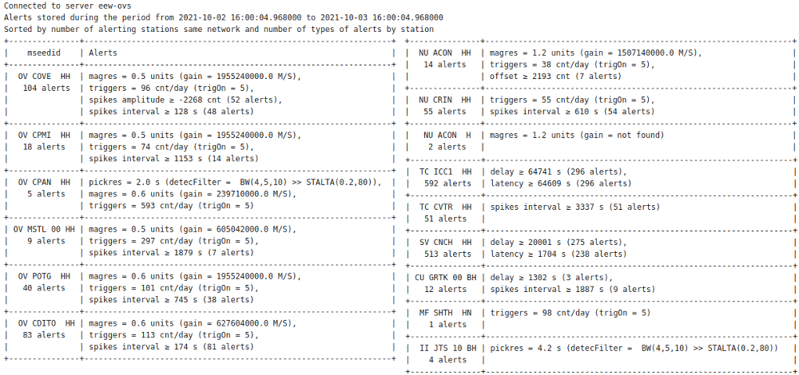
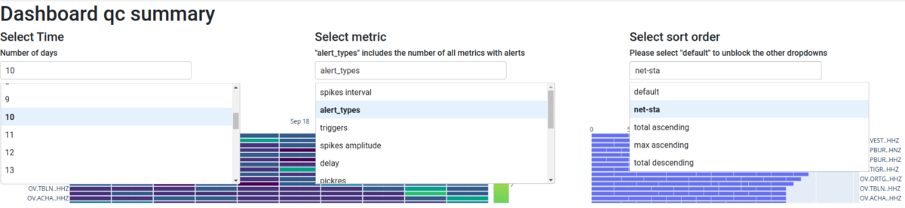
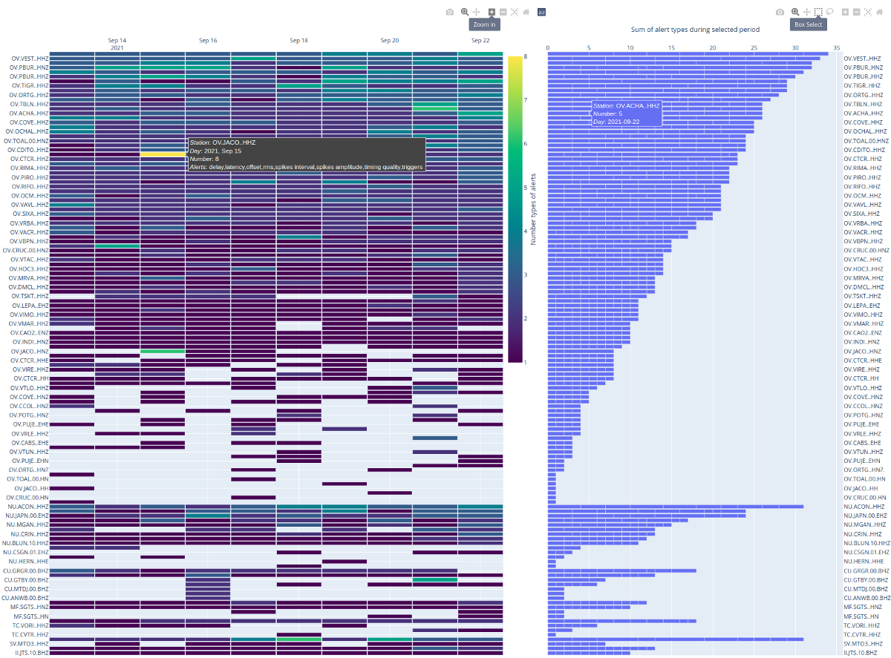

scqcalert
===========

**Quality control alerts**

Description
--------
*scqcalert* is a tool that, based on the evaluation of some parameters, allows monitoring and quality control of station acquisition, signal quality, and the automatic processing system.

   .. note::

      *scqcalert* uses a system of **alerts** produced after evaluating two types of parameters; first, those already calculated by other active tools such as the SeisComP module *scqc* and second, new parameters that are not available in the system.

Alert types
--------

**Imported from scqc**

scqcalert uses a direct connection to the messaging system and collects all alerts calculated and sent by the **scqc** module. Thresholds for sending these alerts and the list of parameters involved must be configured directly in the .cfg file and following the documentation: ref: `scqc`. Currently, the following parameters are available:

- real-time data availability [%]
- delay [s]
- gaps (conteo [counts], intervalo [s], duración [s])
- latencia [s]
- offset [counts]
- overlaps (count [counts], interval [s], length [s])
- rms [counts]
- spikes (count [counts], interval [s], amplitude [counts])
- timing [\%]

**Calculated with scqcalert**

new custom alerts:

- Trigger rate (triggers): Count picks in a time range (1 day by default)  using a connection with the messaging groups configured for ref: `scautopick` and its aliases. If picks exceed a threshold (configurable), an alert will be sent.

- Pick residual (pickres): Evaluate pick time residuals (including non-preferred origins) using a connection with the messaging groups configured for localization modules ref: `scautoloc`. If residual exceeds a threshold (configurable), an alert will be sent.

- Magnitude residual (magres): Evaluate magnitude residuals (including non-preferred magnitudes) using a connection with the messaging groups configured for magnitude calculation modules ref: `scmag`. If residual exceeds a threshold (configurable), an alert will be sent.

- Noisy station alerts using PSD (developing): Analyze the noise of each station using a PSDs database with ObsPy npz files. Alert will send when noise is outside of configurable thresholds (-200 and -60 dB by default). In addition, a detection system was implemented following the STA / LTA logic where the ratio between the PSDs value means calculated with the last N days (configurable) against the estimated with the last hour is compared with a threshold  (configurable) to send alerts.
.. math::
   ratio = average(\frac{PSDlasthour}{PSDlastNdays})

- Archieved data availability (developing): The module queries the fdsnws "availability" service to check the availability of data stored in the archive for each station. If the availability percentage is lower than a configurable threshold, an alert will be sent.

- Flat alerts from scqc parameters (developing): In addition to the alerts sent by scqc generated by sudden changes in the parameters shown in section 4.2. Scqcalert includes configurable thresholds to send alerts if a parameter report values below or above these. For example: delay < 0 seconds.

Outputs
--------

The outputs of this module are addressed to be used by the networks' technical staff to evaluate quality parameters in data acquisition, seismic noise, and automatic processing.

**Email alerts**

An email including all alerts collected from scqc and produced by scqcalert will be automatically sent to a customizable mailing list every reporting period (by default 24 hours). This email includes a table grouping the alerts for all the channels of each instrument. In the column `` mseedid '', the name of the station is presented without including the component. The `` Alerts '' column includes the parameter's name, the worst value of the collected alerts, and additional information, which could be the number of alerts and/or relevant configuration values ​.

The table is sorted by the network in descending order, starting with the network with the highest number of instruments with alerts. Instruments for each network are sorted in descending order, starting with the instrument with the most types of alerts. Here is an example of the table format sent automatically by email:

.. _fig-email:

   Email send by scqcalert
   
**Database with alerts**

Alerts are stored in a database organized with the archive structure:
   .. code-block:: sh
      /year/network/station/channel.location/network.station.location.channel.year.day

By default the database is stored in the path: 
   .. code-block:: sh
      @DATADIR@/scqcalert/
Files are stored in *JSON* format.

**Dashboard**

A dashboard that incorporates all the information provided by scqcalert is included to make easy quality control

.. _fig1-dashboard:

   Drop-down menus included in the Dashboard: Left: the period in days. Center: parameter to analyze (metric). Right: Station sort order method.

Drop-down menus available in the dashboard:

- Select Time (by default 10): It allows choosing from 1 to 30 days. Users can modify these periods in the cfg file, however, when selecting more than 30 days, the dashboard may take more than 5 seconds to read the information from the database and generate the plots.
- Select metric (by default "alert_types"):  Metric or type of alert to analyze. Allows choosing Parameters presented in the Alert types section of this document in addition to a metric called` "alert \ _types" which stores the number of alert types for each station. The user can modify the list of metrics in the cfg file.
- Select sort order (by default "default"): Select the sort order of the stations in the plots. Currently, the following options are available:
default: Order in which the data was imported from the database with JSON files
   - net-sta: The stations are sorted by the network in descending order, starting with the network with the highest number of instruments with alerts. The instruments of each network are sorted in descending order, starting with the instrument with the highest number of types of alerts.
   - total ascending: The stations are arranged in descending order, starting with the station with the highest number of accumulated alerts in the selected period.
   - max ascending: The stations are arranged in descending order, starting with the station with the highest number of alerts in a reported period despite the accumulated value in the entire selected period.
   - total descending: The stations are arranged in ascending order, starting with the station with the lowest number of accumulated alerts in the entire selected period.

   .. note::
      To modify the selection of the drop-down menus "Select Time" and "Select metric", please select the option "default" in the menu "Select sort order". This is because ordering the stations must be done after extracting the information from the database. This clarification is just above the "Select sort order" menu.

The heat map on the left presents the number of alerts per station and per day based on the metric and period selected from the drop-down menus. The horizontal axis shows the day, the vertical axis shows the station, and the color on the graph shows the number of alerts. Here are some comments about this graph:

The heat map on the left presents the number of alerts per station and per day based on the metric and period selected from the drop-down menus. The horizontal axis shows the day, the vertical axis shows the station, and the color on the graph shows the number of alerts. Here are some comments about this graph:

- When selecting the metric "alert_types" the colors mean the number of types of alerts. When selecting any other metric, the colors mean the number of alerts of the selected metric.
- Only stations with alerts stored by scqcalert are included
- The graph will be reordered according to the selection in the "Select sort order '' drop-down menu.
- The graph is interactive with dynamic options shown in the upper right corner.
- Hovering the pointer over any cell in the graph will show associated information with the cell: station, day, number of alerts, and types of alerts (dark gray box in the Figure).

The histogram on the right shows the number of accumulated alerts per station for the metric and period selected from the drop-down menus. The horizontal axis indicates the number of alerts, and the vertical axis indicates the station name. Here are some comments about this graph:

- When selecting the metric "alert_types" the horizontal axis shows the number of accumulated alert types. When selecting any other metric, the horizontal axis indicates the number of accumulated alerts of the selected type.
- Only stations with alerts stored by scqcalert are included
- The graph will be reordered according to the selection in the "Select sort order '' drop-down menu.
- The graph is interactive with dynamic options shown in the upper right corner.
- Each histogram bar is divided by cells representing each day during the reporting period.
- Hovering the pointer over any cell in the graph will show the information associated with this cell: station, number of alerts/types of alerts, and day (blue box in the Figure).
